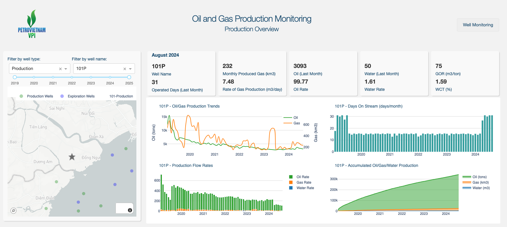

# Oil Gas Production Dashboard
This repository contains a Dash Plotly project for building a web dashboard to monitor oil and gas production data. This project is part of INFO 5602, taught by [Prof. Abel Iyasele](https://www.colorado.edu/cmci/people/information-science/abel-iyasele) at CU Boulder, Summer 2025.

## Project Preview



## Features

- Interactive visualizations for oil and gas production metrics
- User-friendly web interface powered by Dash and Plotly
- Easily customizable for different datasets

## Getting Started

### Prerequisites

- Python 3.x
- Required Python packages (see `requirements.txt`)

### Running Locally

1. Clone this repository:
    ```bash
    git clone https://github.com/tuanna712/oil-gas-production-dashboard.git
    cd oil-gas-production-dashboard
    ```
2. Install dependencies:
    ```bash
    pip install -r requirements.txt
    ```
3. Run the app:
    ```bash
    python app.py
    ```
4. Open your browser and go to `http://127.0.0.1:8050/`

### Deployment

You can deploy `app.py` to web services such as Heroku, Azure, or AWS. Refer to the respective platform documentation for deployment instructions.

## Main File

- `app.py`: Entry point for running the dashboard.

## License

This project is licensed under the MIT License.

## Demo

A live demo can be seen here: [https://oil-gas-production-dashboard.onrender.com/](https://oil-gas-production-dashboard.onrender.com/)